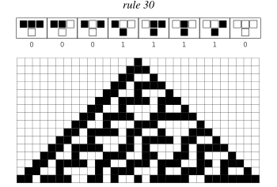

# Wolfram



## Installation:

- Install **stack** on your machine
- clone the repository
- "stack build"
- make with the provided Makefile
- start the program as specified in **Usage**
- enjoy the 256 generation rules


## Information:
**–-rule**: the ruleset to use (no default value, mandatory)

**–-start**: the generation number at which to start the display. The default value is 0.

**–-lines**: the number of lines to display. When omitted, the program never stops.

**–-window**: the number of cells to display on each line (line width). If even, the central cell is displayed in the next cell on the right. The default value is 80.

**–-move**: a translation to apply on the window. If negative, the window is translated to the left. If positive, it’s translated to the right.

Only **rule** has to be specified

## Usage:

```bash
    USAGE:
        ./wolfram --rule x1 --lines x2 --window x3 --start x4 --move x5
```

## Project:

This wolfram takes the rule number and convert it to a 8-bit binary number.
This binary enables the generation of various rules for the cellular automaton, with each unique rule represented by a distinct binary pattern.

    

The generation process is fundamentally based on the examination of three cells at a time, shifting by one position at each step, to indentify an exhaustive pattern and complete the next line.


## 256 Rules:


Take a look at : [https://mathworld.wolfram.com/ElementaryCellularAutomaton.html]